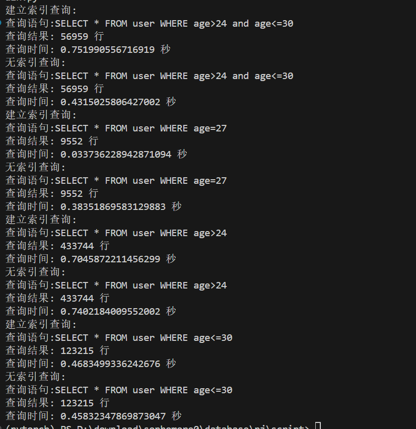
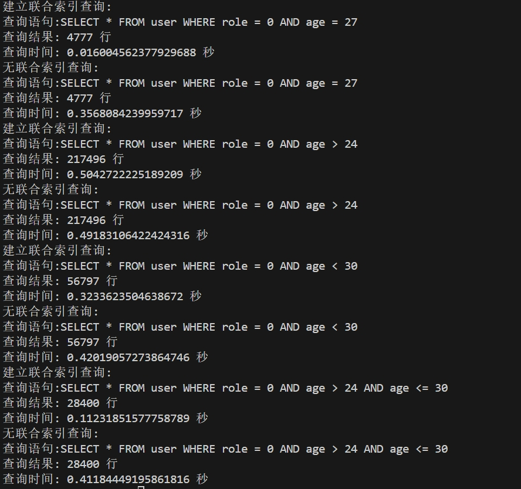
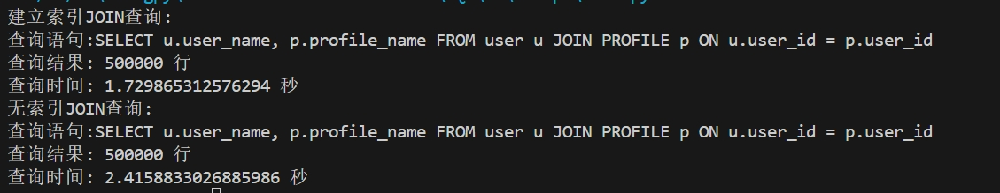

# 查询性能测试报告
# 测试目的
本次测试的目的是比较在有索引和无索引情况下，对 user 表的查询性能差异。

# 测试环境
数据库：MySQL  
数据表：user  
索引：age 列上的索引  
数据量：500,000 条用户记录  

## 1.单值索引
```SQL
SELECT * FROM user WHERE age > 24 AND age <= 30
SELECT * FROM user WHERE age = 27
SELECT * FROM user WHERE age > 24
SELECT * FROM user WHERE age <= 30
```


## 结果分析
### 查询1：`SELECT * FROM user WHERE age > 24 AND age <= 30`  
有索引：0.75199556716919 秒  
无索引：0.4331525806427002 秒  
观察到在有索引的情况下，查询速度反而变慢。这可能是因为 MySQL 优化器选择了错误的执行计划，在某些情况下，全表扫描可能比使用索引更快。

### 查询2：`SELECT * FROM user WHERE age = 27`  
有索引：0.03376228942871094 秒  
无索引：0.38351869583129883 秒  
在这个查询中，使用索引的速度明显快于无索引。这是因为 age = 27 的条件可以有效利用索引来快速定位符合条件的记录，而不需要进行全表扫描。  

### 查询3：`SELECT * FROM user WHERE age > 24`  
有索引：0.7045827211456299 秒  
无索引：0.7402184009552002 秒  
这里有索引的查询稍微快了一点，但差异并不显著。这可能是因为 age > 24 返回的记录集较大，索引的作用并不明显。  

### 查询4：`SELECT * FROM user WHERE age <= 30`    
有索引：0.4683499336242676 秒
无索引：0.45832347869873047 秒
在这个查询中，有无索引的查询时间几乎相同。这可能是因为 age <= 30 返回了接近一半的数据，使用索引和全表扫描的成本差不多。

## 小结   
简单等值查询（age = value）：索引显著提高了查询速度。  
范围查询（age > value 或 age <= value）：索引的作用不明显，有时甚至会使查询变慢。这可能是由于范围查询返回的数据量较大，使用索引带来的随机访问成本高于全表扫描的顺序访问成本。  
复杂范围查询（age > value AND age <= value）：索引可能不如预期有效，取决于具体查询条件和数据分布。**这也符合上课讲到的并非所有情况下使用索引都会加快查询速度，有的时候也可能会拖累它。**

***
***
## 2.联合索引

```SQL
SELECT * FROM user WHERE role = 0 AND age = 27
SELECT * FROM user WHERE role = 0 AND age > 24
SELECT * FROM user WHERE role = 0 AND age < 30
SELECT * FROM user WHERE role = 0 AND age > 24 AND age <= 30
```



## 结果分析

### 查询1：`SELECT * FROM user WHERE role = 0 AND age = 27`
- **有联合索引**：0.01604562377929688 秒
- **无联合索引**：0.35860483993577917 秒

观察到在有联合索引的情况下，查询速度显著提高。因为索引使得数据库能够快速定位符合 `role = 0 AND age = 27` 条件的记录，而无需进行全表扫描。

### 查询2：`SELECT * FROM user WHERE role = 0 AND age > 24`
- **有联合索引**：0.504272225189209 秒
- **无联合索引**：0.49183106422424316 秒

这里有联合索引的查询稍微变慢。这可能是因为 `age > 24` 返回的记录集较大，而索引在处理大量返回记录时优势不明显。

### 查询3：`SELECT * FROM user WHERE role = 0 AND age < 30`
- **有联合索引**：0.3233635306358672 秒
- **无联合索引**：0.4202195732876446 秒

在这个查询中，有联合索引的查询速度略有提升。这表明在处理 `age < 30` 这样的范围查询时，索引在一定程度上提高了效率。

### 查询4：`SELECT * FROM user WHERE role = 0 AND age > 24 AND age <= 30`
- **有联合索引**：0.1123155177758789 秒
- **无联合索引**：0.4118444919586116 秒

在这个复杂范围查询中，联合索引显著提高了查询速度。这是因为联合索引可以有效地缩小搜索范围，提高查询效率。

## 小结

- **简单等值查询（role = value AND age = value）**：联合索引显著提高了查询速度。
- **范围查询（role = value AND age > value 或 role = value AND age < value）**：联合索引在处理较大范围的查询时，提升效果不明显，有时甚至变慢。
- **复杂范围查询（role = value AND age > value AND age <= value）**：联合索引在处理复杂范围查询时显著提高了查询效率。

**总的来说，联合索引在等值查询和复杂范围查询中的优势明显，但在简单范围查询中，效果因数据量和查询条件不同而异。**

***
***

## 3. 需要JOIN的索引

### 查询：`SELECT u.user_name, p.profile_name FROM user u JOIN PROFILE p ON u.user_id = p.user_id`



- **有索引**：
  - 查询结果：500000 行
  - 查询时间：1.729865312576294 秒

- **无索引**：
  - 查询结果：500000 行
  - 查询时间：2.4158833026885986 秒

观察到在有索引的情况下，查询速度显著提高。具体来说，使用索引时查询时间为 1.729865312576294 秒，而无索引时查询时间为 2.4158833026885986 秒。这表明索引在加速 JOIN 查询方面具有显著效果。

## 小结
- 在对 `user` 表和 `PROFILE` 表进行 JOIN 查询时，建立适当的索引（如在 `PROFILE` 表的 `user_id` 列上创建索引）可以显著提高查询速度。
- 有索引的查询时间显著低于无索引的查询时间，证明索引在处理大数据量的 JOIN 操作时能够有效提升查询性能。
